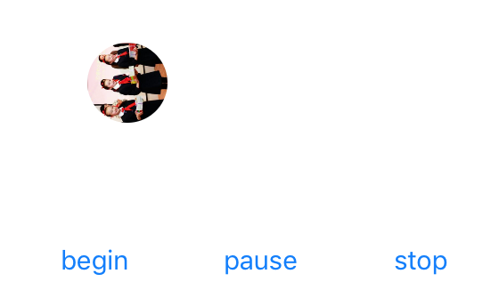

#转动的 UIView

一个 UIView 的扩展（Category），它允许任何 UIView 子类，比如 UIButton，UIImageView 在视图中做旋转动画：

它的使用很简单，导入头文件 UIView+Rolling.h 即可。如果要开始旋转，调用 beginRoll 方法，暂停为 pauseRoll 方法，停止并恢复原状为 stopRoll 方法。

旋转的速度由两个属性控制：rollSpeed 和 timerInteral。前者表示每秒钟转动多少度（默认为 360/8，即每秒转动 40度）。后者表示定时器的刷新率（即动画的流畅程度，这个值越小越流畅，默认为 0.01，建议此值小于 0.03333，即 30帧/秒）。